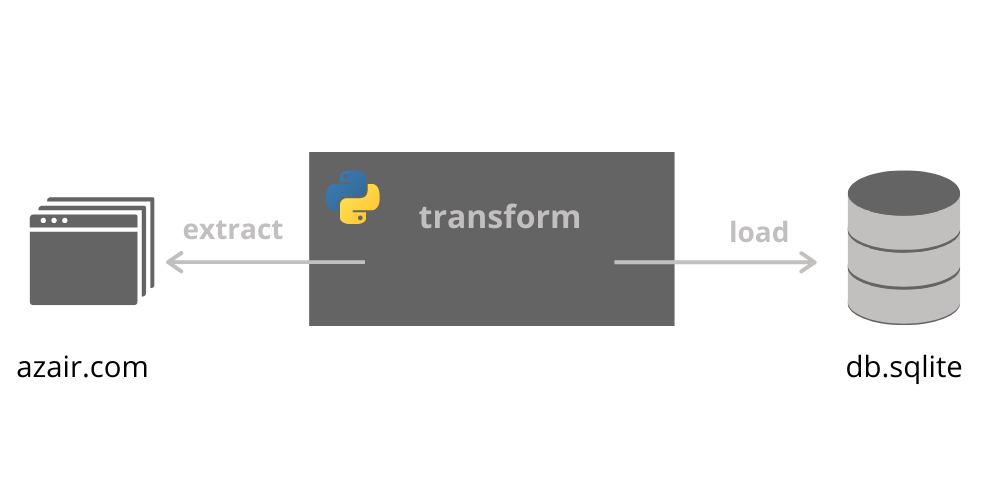

# Example ETL job using Python
[](https://www.python.org/downloads/release/python-360/)
This example ETL jobs scrapes data from `azair.com`, formulates records and saves them into the SQLite database.



## Requirements

1. [Docker](https://www.docker.com/)


## Run ETL job
You can use optional parameter with tag version. (eg. `v0.1`)
1. Build docker image
```sh
./build.sh
```

2. Run docker image
```sh
./run.sh
```


## Run tests

```sh
pytest --show-capture=no 
```